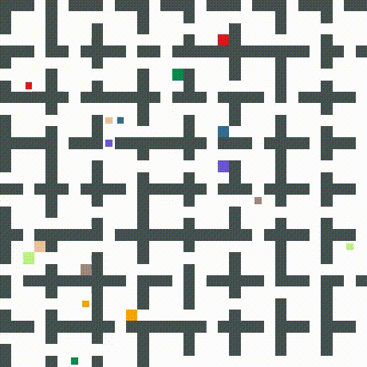

# Multi-agent-pathfinding
Conflict-based search for optimal multi-agent pathfinding
## Getting started
Run the following command:
```bash
git clone https://github.com/Stepan-Makarenko/Multi-agent-pathfinding-CBS-ICBS.git
```
or download this repository.  
## Problem definition
In the multi-agent pathfinding problem (MAPF) we are given a set of agents each with respective start and goal positions. The task is to find paths for all agents while avoiding collisions.
## Algorithm
The [**CBS algorithm**](http://www.bgu.ac.il/~felner/2015/CBSjur.pdf) and its [**modification**](https://www.ijcai.org/Proceedings/15/Papers/110.pdf), CBS + PC, that uses conflict prioritization, were implemented in Python. 
## Input format
It is recommended to use maps and tasks (where agents' start and goal positions are given) in the .map and .scen Moving AI formats.  
The data can be found [**here**](https://www.movingai.com/benchmarks/mapf.html).  
The formats are described [**here**](https://www.movingai.com/benchmarks/formats.html).  
It is also possible to run the code on maps represented as strings (. - an empty space, # - an obstacle) and agents represented as tuples (x start, y start, x goal, g goal). In order to do so it is necessary to create a list of class Agent instances (an example can be found in the Explore.ipynb file).  

We also created a set of 100 8x8 maps with an average of 15% obstacles and scenes for 16 agents in the formats described above. It is guaranteed that all free slots on the maps are connected by paths and every scene is valid.
## Output format
The algorithm solves the MAPF instance and returns a set of non-conflicting paths for all agents and their respective costs. Additionally, it can return an image and an .mp4 video demonstrating agents' start and goal positions and movements.  
When experiment_mode=True, number of ctnodes created and runtime are returned instead.
## Working with MAPF instances 
.map files can be also converted to strings by using the read_map function from map_handler.py, .scen files can be read as a list of tasks (each task also represented by a list) by using the read_tasks function from map_handler.py (both require a path to the .map or .scen file in question).  
Run test from tests.py on maps represented as strings and agents represented as a list of Agent instances.  
Run movingai_test from tests.py on Moving AI data. A given number of random tasks or specific tasks from .scen can be selected.   
The parametrs use_pc and diagonal_movements are responsible for conflict prioritization and whether diagonal movements of agents are allowed.  
The examples of both test and movingai_test applied to maps and tasks are presented in Explore.ipynb.
## Working examples



